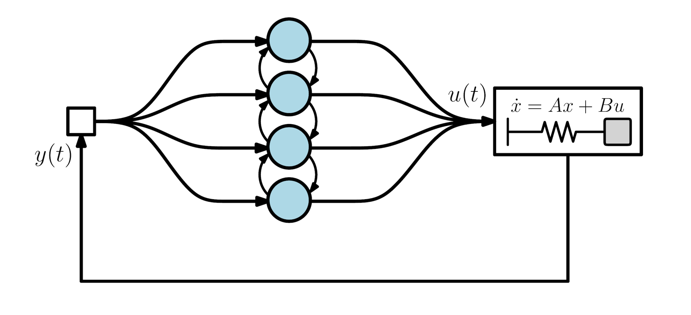
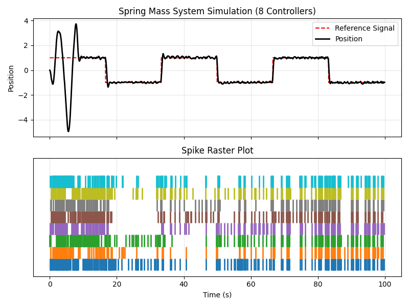
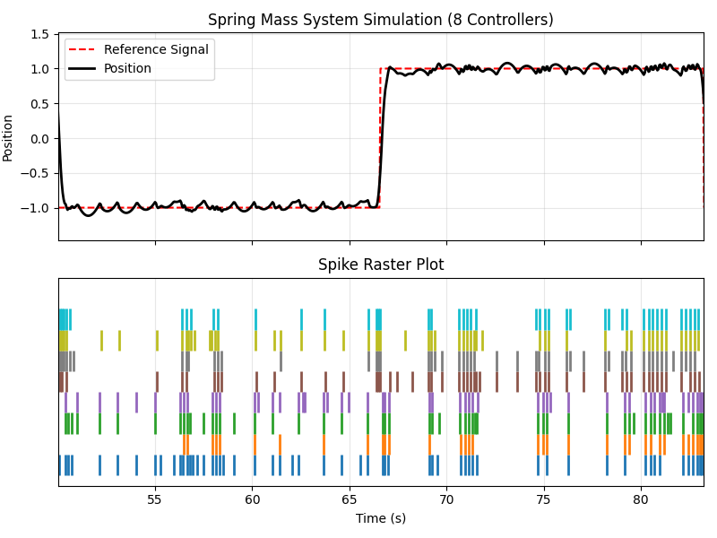

# Spiking Neurons as Data-Driven Controllers for LTI Systems
This repository contains to the best of my knowledge the first implementation of a Spiking Data-Driven Controller for control of Linear Time-Invariant (LTI) systems. The controller is based on the Data-Driven Design framework, where control actions or multi-step-ahead predictions are computed directly based on measured input-output data, without requiring any explicit model of the system to be controlled. Data-driven methods are typically expressed in terms of large data matrices containing input-output trajectories of the system. This implementation instead rewrites the predictor in terms of fixed-size covariance matrices. The covariance estimates can be updated recursively as new input-output data is collected through interaction with the system, enabling online learning and adaptation.

The neuron is modelled as a data-driven multi-step-ahead predictor of the next outputs of the plant. Two covariance matrices are used to express an optimal linear predictor of future plant outputs given the planned control input and a short history of past inputs and outputs. The future outputs are predicted in two ways: (i) assuming that the neuron does not spike, and (ii) assuming that the neuron spikes. Quadratic costs are assigned to both predictions based on the deviation from a reference signal, with an additional cost associated with firing a spike. The neuron spikes if the prediction with a spike yields a lower total cost than the non-spiking prediction. 

The control signal from the neuron is an impulse delivered to the plant when the neuron spikes. The strength of the impulse is fixed, and hence at least two neurons with opposite spike signs are needed to deliver both positive and negative control actions. It is observed that greater control performance is achieved when the neurons receive spikes from other neurons as input in addition to the plant output, i.e., when the neurons are connected in a network. Performance is also observed to improve with more than the bare minimum of two neurons in the network.

## Results
To illustrate the performance of the Spiking Data-Driven Controller we consider control of a simple spring-mass-damper system using a fully connected network of spiking neurons. As illustrated below, each neuron receives the plant output (the mass position) as well as the spikes from all other neurons in the network as inputs. The input to the plant is the sum of the spikes from all neurons in the network, where half of the neurons deliver positive impulses and the other half deliver negative impulses.

Using a network of eight spiking neurons, the system is able to accurately track a reference signal, as shown below. The left figure shows the mass position tracking the reference signal over time, with spikes from the eight neurons shown in the raster plot below. The right figure gives a zoomed-in view. Note that at the start of the simulation the neurons have no prior knowledge of the dynamics, but learn to control the plant within a few seconds of interaction.
|  |  |
|:---:|:---:|

## Usage
To run the simulation, execute the `run.py` script after installing the required dependencies. The simulation parameters are specified in a configuration file in YAML format. Configuration files for two, four, and eight neurons are provided in the repository, and can be adapted as desired.

